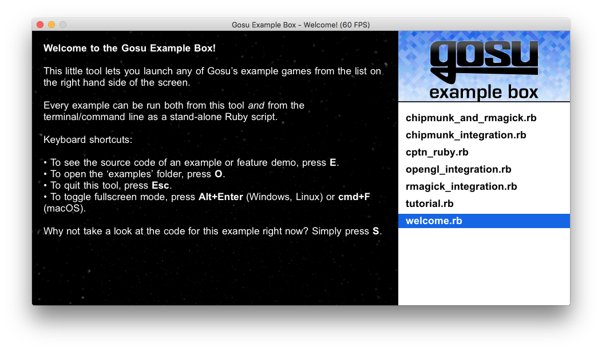

Gosu Examples
=============



This is a collection of Ruby example games for the [Gosu library](https://www.libgosu.org/).

(You can find C++ examples in the [main gosu repository](https://github.com/gosu/gosu/tree/master/examples).)

To install and run the `gosu-examples` gem:

```bash
gem install gosu-examples
gosu-examples
```

You can also [download and unpack this repository](https://github.com/gosu/gosu-examples/archive/master.zip) and then run individual examples from the terminal:

```bash
cd gosu-examples-master/examples
ruby tutorial.rb
```

Some examples require the following additional libraries:

```bash
gem install chipmunk
gem install rmagick
gem install opengl-bindings
```
